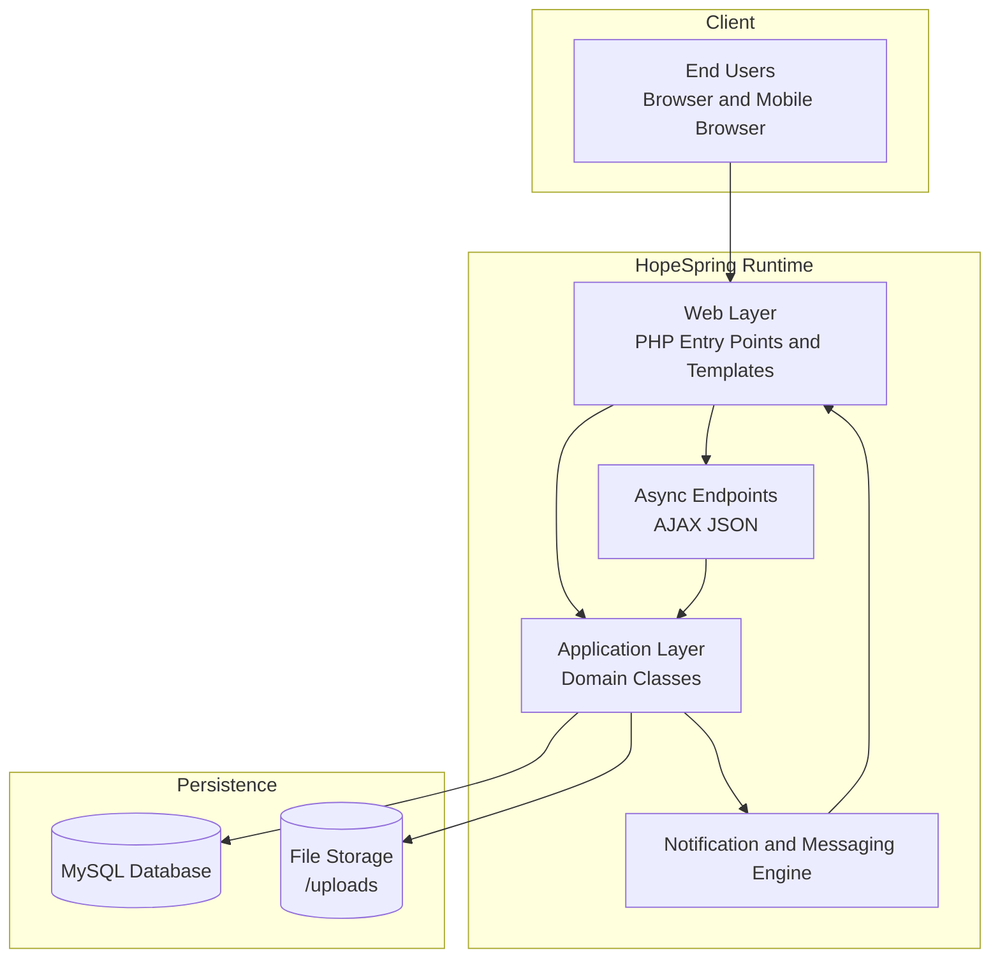
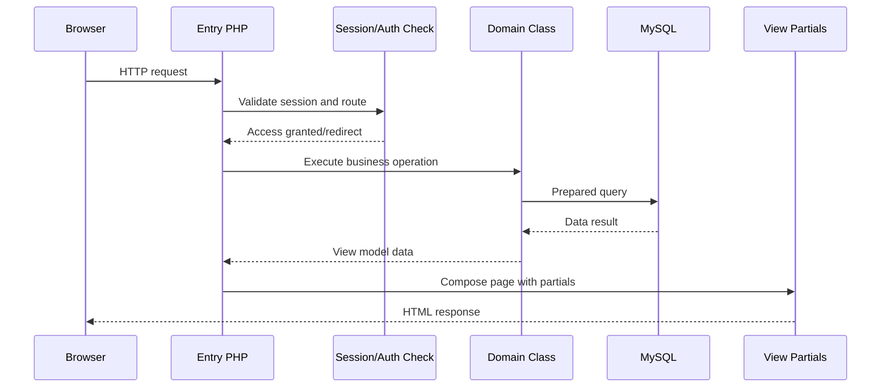
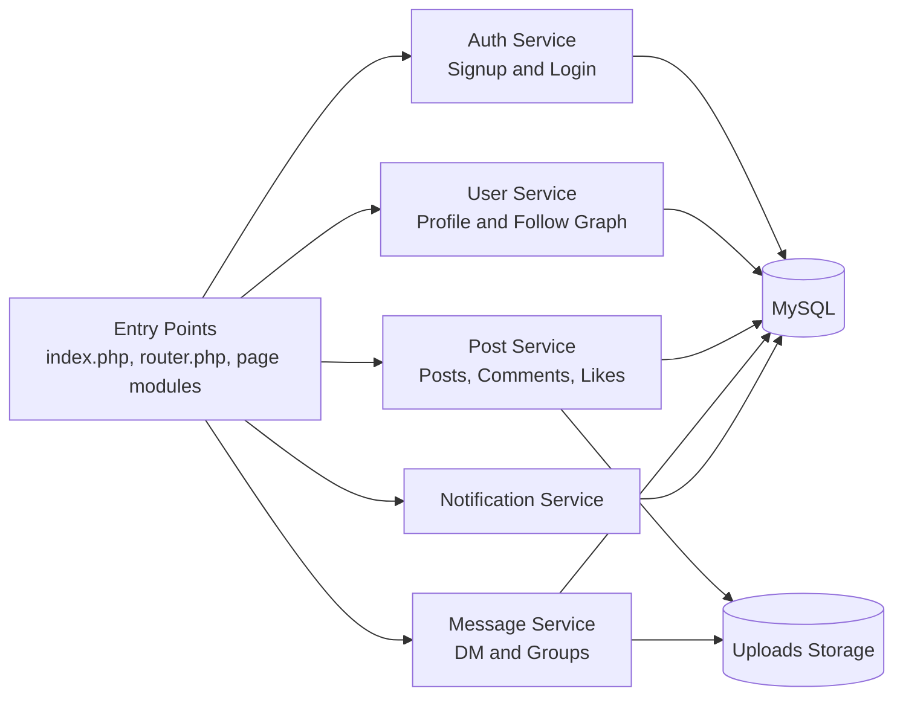
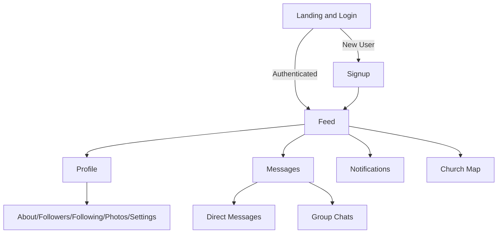
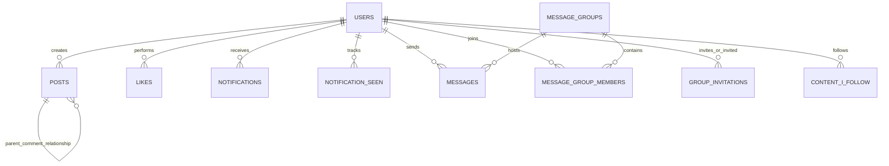
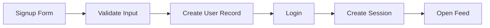
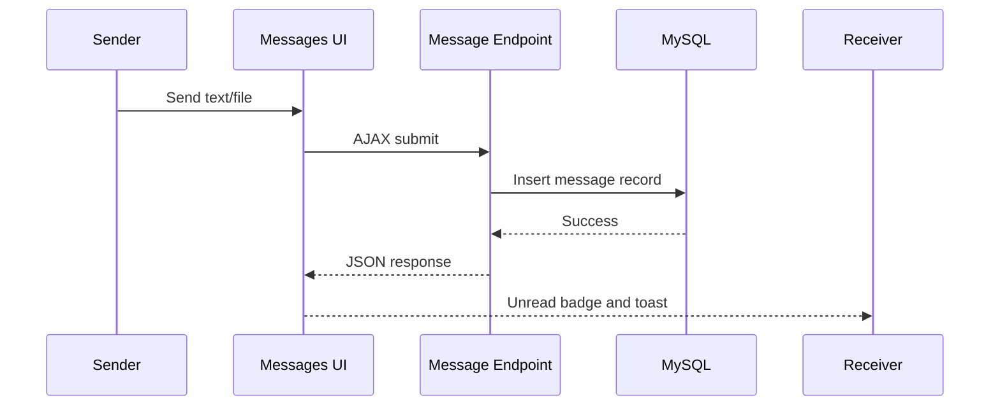
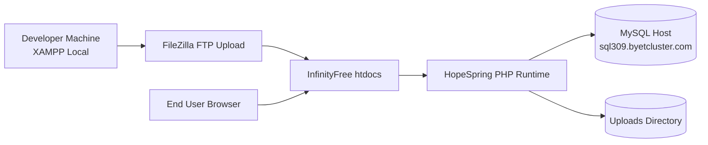

# HopeSpring Professional Project Report

**Project Name:** HopeSpring  
**Prepared For:** Hermann N'zi Ngenda  
**Report Date:** April 1, 2026  
**System Type:** PHP/MySQL Social Community Web Application

---

## 1. Executive Summary

HopeSpring is a faith-centered social platform that combines classic social networking capabilities with community-focused communication features. The application supports user registration and authentication, personal profiles, timeline posting, likes/comments/following, direct and group messaging, notifications, and a geolocation-based church discovery map.

From a technical standpoint, the project is implemented as a server-rendered PHP web application using a modular page structure, reusable partial components, and class-based business logic over a MySQL database.

The architecture is straightforward and production-viable for shared hosting platforms (including InfinityFree), with recent security upgrades introducing prepared statements, CSRF token checks, and environment-based database configuration.

---

## 2. Project Objectives and Functional Scope

### 2.1 Business and User Goals

- Provide a social platform for Christian users to connect and interact.
- Support personal expression through posts, profile customization, and media sharing.
- Enable social graph growth through follow/follower relationships.
- Facilitate real-time-like communication through direct and group messaging.
- Encourage local community engagement through church location discovery.

### 2.2 Core Functional Modules

- Authentication: sign-up, login, logout, session access control.
- Social Feed: create/read timeline posts, comments, likes.
- Profile Management: profile details, profile/cover photos, settings.
- Notifications: activity tracking for follows, likes, comments, tags.
- Messaging: direct messages, group chats, file/image attachments.
- Discovery: search users, friend suggestions.
- Church Map: geolocation and nearby church lookup.

---

## 3. High-Level Architecture

HopeSpring uses a traditional monolithic web architecture with logical modularization.

### 3.0 System Architecture Diagram

### 3.1 Logical Layers

- Presentation Layer
  - PHP page templates and reusable partials render HTML views.
  - CSS styling and small JavaScript modules handle client-side interactions.

- Application/Domain Layer
  - Class files in the classes module encapsulate core business operations.
  - Features include users, posts, authentication, settings, messages, profiles.

- Data Access Layer
  - Database class provides connection management and query execution.
  - Prepared statement helper methods are used by feature classes.

- Persistence Layer
  - MySQL schema with tables for users, posts, likes, notifications, messaging, and follow-tracking.

### 3.2 Runtime Request Flow

1. Browser sends request to a page entry point.
2. Session and authentication state are evaluated.
3. Relevant class methods execute business and data logic.
4. Page template composes output using partials.
5. Response is returned as HTML or JSON (for AJAX endpoints).

### 3.3 Request Lifecycle Sequence

---

## 4. Backend Architecture and Implementation

### 4.1 Bootstrap and Session Lifecycle

- Session initialization is centralized and consistently checked before protected pages.
- The main entry path validates logged-in state and redirects unauthorized users to authentication flows.
- A lightweight autoload include aggregates core class dependencies.

### 4.2 Configuration and Database Connectivity

- Environment-driven DB config is loaded from a root .env file.
- A Database class encapsulates:
  - Connection initialization.
  - utf8mb4 charset setup.
  - Prepared read and write methods.
  - Utility methods (insert ID, close).

This design supports both local development and hosted deployment without hardcoded credentials.

### 4.3 Domain Services

#### Authentication Service

- Signup class validates fields and creates users.
- Login class validates credentials and sets session user ID.
- Passwords are hashed with SHA-1 in current implementation.

#### User and Social Graph Service

- User class handles profile retrieval and social graph relationships.
- Follow relationships are persisted in likes table JSON structures.
- Friend suggestions are generated by excluding self and already-followed users.

#### Post Service

- Post class handles create/edit/delete and read operations.
- Supports image uploads with resizing via Image utility.
- Supports comments as child posts (parent relationship).
- Supports tagging and notification integration.

#### Messaging Service

- Message class supports:
  - Direct messaging.
  - Group creation and membership.
  - Group invitations.
  - Attachment uploads.
  - Unread counting and seen-state updates.
- Includes schema self-check logic to create/alter message tables if needed.

#### Notification Service

- Notification records are generated for social actions.
- Seen-state tracking enables unread counting behavior.

### 4.4 API and Async Endpoints

AJAX endpoint dispatcher handles:

- Like actions.
- Message unread checks.
- Recent post checks from followed users.

JSON payloads enable dynamic UI updates, notification toasts, and periodic polling behavior.

### 4.5 Backend Component Diagram

### 4.6 Security Controls Present

- Prepared statements in major query paths.
- CSRF token generation and validation utilities.
- Environment variable use for sensitive DB credentials.
- Basic authentication session checks on protected routes.

### 4.7 Backend Observations

Strengths:

- Clear separation of concerns by feature class.
- Prepared statement migration completed across key modules.
- Practical support for shared hosting constraints.

Improvement opportunities:

- Upgrade password hashing from SHA-1 to password_hash/password_verify.
- Replace any remaining direct SQL fragments in edge paths.
- Add structured error logging instead of raw die statements in production.
- Introduce service/repository separation for long-term maintainability.

---

## 5. Frontend Architecture and User Experience

### 5.1 Rendering Model

- Server-side rendering (SSR) with PHP templates.
- Reusable partials for header, post card, comments, profile sections.
- Dedicated page modules for feed, auth, profile, notifications, messages, and map.

### 5.2 Design System and Styling

- Central stylesheet defines:
  - Color variables and component tokens.
  - Card-based layout and utility classes.
  - Buttons, forms, navbar, sidebar, and chat UI styles.
- Responsive layout logic supports mobile and desktop experiences.

### 5.3 Client-Side Interactivity

- Vanilla JavaScript used for:
  - Password visibility toggles in auth forms.
  - Profile/cover image modals.
  - Notification polling and toast rendering.
  - Browser notification API integration.
  - Dynamic map rendering and search interactions.

### 5.4 Frontend Feature Breakdown

#### Authentication UI

- Login/signup pages with validation feedback and CSRF hidden fields.
- Clear branding and streamlined form controls.

#### Feed UI

- Post composer with image attachment support.
- Timeline cards with social actions.
- Pagination controls and empty-state handling.

#### Profile UI

- Hero cover/profile section with action modals.
- Sectional navigation (timeline, about, followers, following, photos, settings).

#### Messaging UI

- Conversation sidebar (DM + groups).
- Active chat panel with text and attachments.
- Group creation flow and call links.
- Voice note UX scaffolding present.

#### Church Map UI

- Leaflet map integration.
- Geolocation + place search.
- Overpass API church discovery and recommendation cards.

### 5.5 Frontend Navigation Flow

### 5.6 Dedicated Full Flow Diagram Pack

For a complete, code-aligned set of operational diagrams (system flow, auth flow, feed/social flow, messaging flow, AJAX/notification flow, and map flow), see:

- PROJECT_FLOW_DIAGRAM.md

---

## 6. Data Model Summary

Primary tables identified:

- users
- posts
- likes
- notifications
- notification_seen
- content_i_follow
- messages
- message_groups
- message_group_members
- group_invitations

Data model supports:

- Core account/profile identity.
- Social timeline and engagement interactions.
- Notification feed and seen tracking.
- Direct/group communication with role-aware group membership.

### 6.1 Entity Relationship Diagram (Conceptual)

---

## 7. End-to-End Workflow Examples

### 7.1 New User Onboarding

1. User submits sign-up form.
2. Backend validates input and uniqueness constraints.
3. User record is created.
4. User logs in and session is established.
5. User is redirected into profile/feed experience.

### 7.2 Post and Notification Flow

1. Authenticated user submits post or comment.
2. Post service validates and stores content.
3. Optional media is uploaded and resized.
4. Tags are parsed and notifications are generated.
5. Followers/owners receive notification visibility updates.

### 7.3 Messaging Flow

1. User opens DM or group thread.
2. Messages are loaded and unread states updated.
3. User sends text or attachment.
4. Message record is inserted.
5. Receiver sees unread indicators and notification toasts.

---

## 8. Deployment and Operations Notes

### 8.1 Runtime Requirements

- PHP environment with mysqli enabled.
- MySQL database initialized with project SQL schema.
- Writable uploads directories for media and message attachments.

### 8.2 Production Configuration

- Root .env file required for DB host/name/user/password.
- .htaccess rewrite rules support clean page routing behavior.
- Shared-hosting-compatible architecture verified.

### 8.3 Operational Considerations

- Ensure hidden files (.env, .htaccess) are uploaded.
- Validate DB credentials and imported schema before first run.
- Monitor error logs for connection or permission failures.

### 8.4 Deployment Topology Diagram (InfinityFree)

---

## 9. Quality, Security, and Maintainability Assessment

### 9.1 Current Maturity

HopeSpring demonstrates solid feature completeness for a social platform MVP-to-production tier in a shared-hosting context. The modularized class architecture and reusable page partials are suitable for iterative enhancement.

### 9.2 Priority Recommendations

1. Security hardening
   - Migrate password hashing to modern PHP password APIs.
   - Introduce rate limiting for login and message endpoints.
   - Add stricter server-side file MIME and extension verification.

2. Reliability and observability
   - Add centralized error handling/logging strategy.
   - Add health-check and environment diagnostics page (admin-only).

3. Performance and scalability
   - Add indexes for heavily queried columns (post timelines, notifications, messages).
   - Reduce repeated user fetch calls in loops via batch queries.

4. Codebase evolution
   - Move toward PSR-4 autoloading and namespaced classes.
   - Introduce simple test coverage for core service methods.

---

## 10. Conclusion

HopeSpring is a comprehensive, community-oriented social platform with meaningful domain features and a practical technical foundation. The backend implements key social-network behaviors with security improvements already in place, while the frontend delivers a modern and interactive user experience through server-rendered pages and targeted JavaScript enhancements.

The project is currently suitable for production use on shared hosting and has a clear path for enterprise-grade hardening through incremental security, observability, and architecture improvements.

---

## Appendix A: Diagram Notes for PDF Export

- This report uses Mermaid syntax for professional architecture and flow diagrams.
- If your PDF exporter does not render Mermaid blocks, use a Markdown-to-PDF plugin with Mermaid support.
- Alternative workflow: export the document to HTML first, verify diagram rendering, then print to PDF.

---

## Appendix B: Report Ownership

This report was prepared by

**Hermann N'zi Ngenda**  
**Project:** HopeSpring
