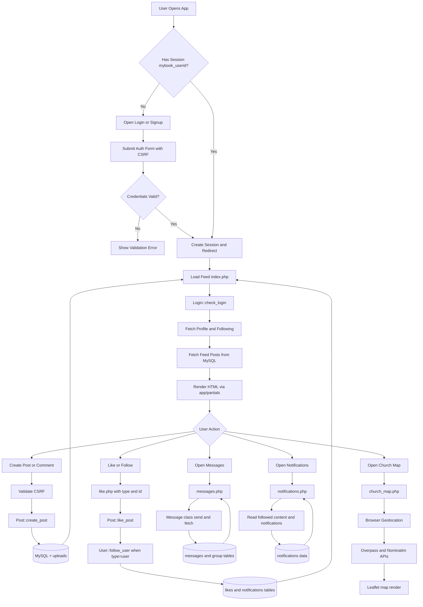
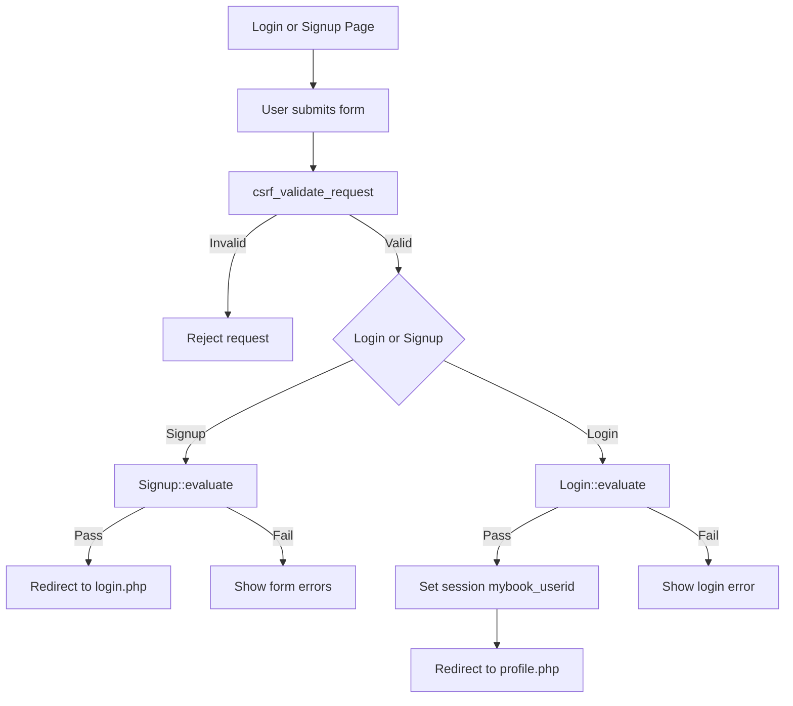
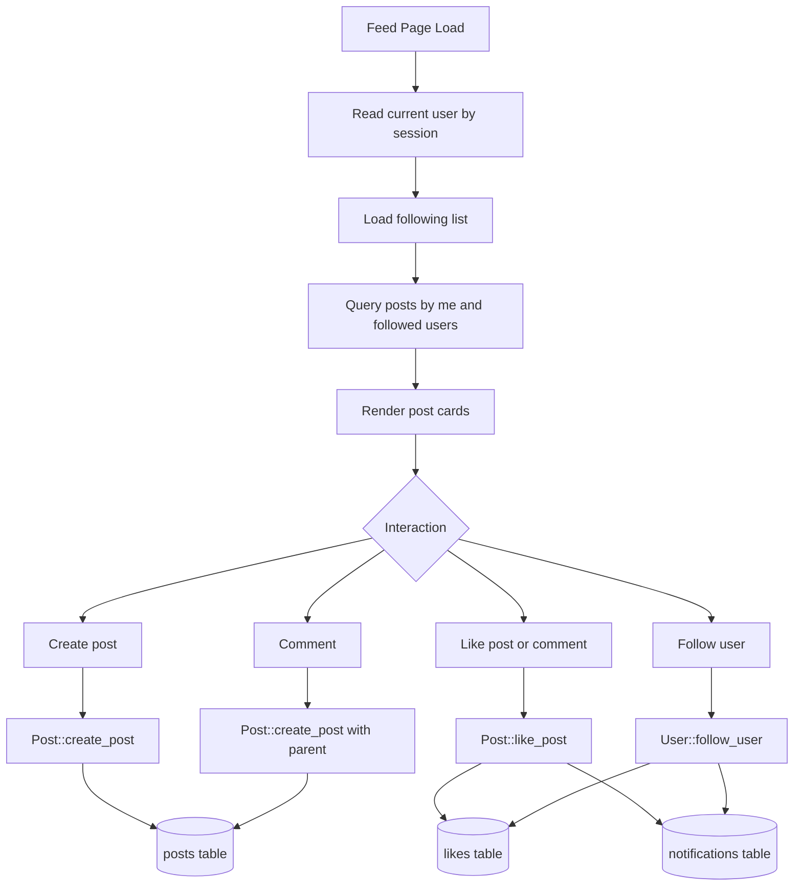
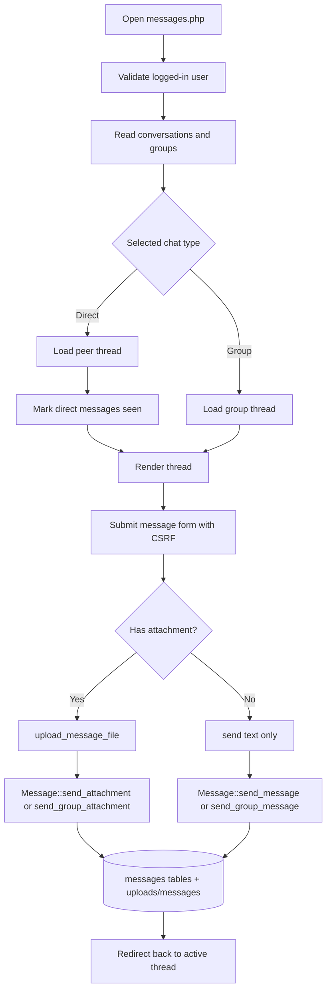
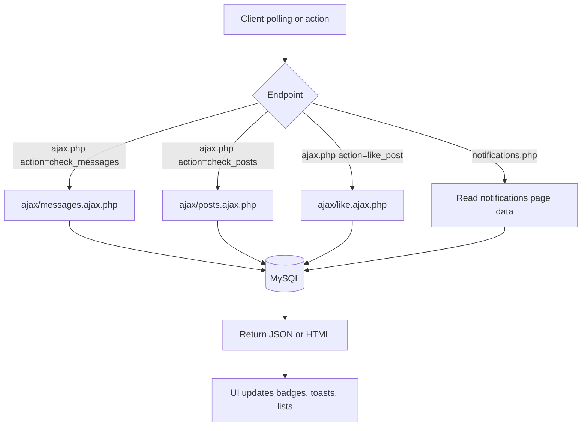
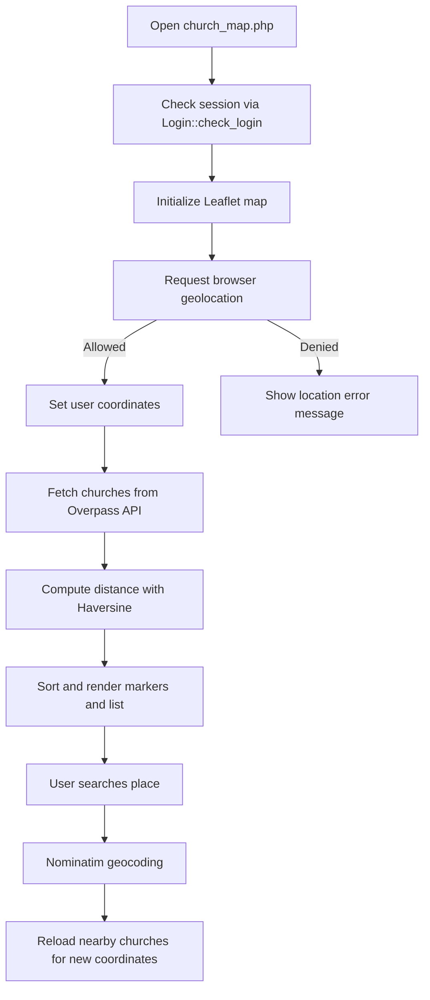

# HopeSpring Project Flow Diagrams

This document explains how the HopeSpring project works through visual flow diagrams based on the current codebase.

## 1. End-to-End System Flow

## 2. Authentication Flow

## 3. Feed and Social Interaction Flow

## 4. Messaging Flow (Direct and Group)

## 5. Notifications and AJAX Polling Flow

## 6. Church Map Flow

